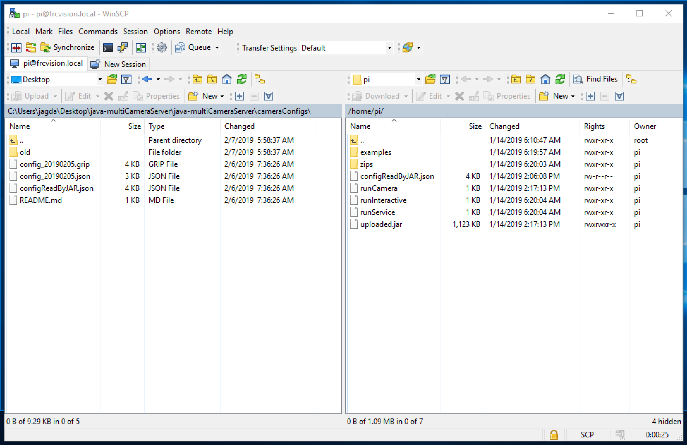

## How to implement a static config for the camera

1. Set your parameters using the frcvision.local interface
1. Save parameters by using Right-Click->Save Link As... on "Source Config JSON"
1. Copy and paste parameters into the provided file called "configCamera0.json" 
**DO NOT REPLACE THE EXTRA STUFF IN THERE**
1. Set rPI to Writable using frcvision.local interface
1. Copy the new JSON to the pi:
    1. cd to the cameraConfigs directory
    1. Run 
    ```scp configCamera0.json pi@frcvision.local:/home/pi```
      (or use WinSCP if you're a Windows user)
    1. When prompted, enter "raspberry" as password
1. Voila! The file should be automatically read by java-multiCameraServer-all.jar
You can use different config files for different cameras - you'll just have 
to update each file individually and call it using the Camera(configFile) constructor.

## Using WinSCP to run Step 5.ii

1. Open WinSCP, connect using the following settings:
- File protocol: SCP
- Host name: frcvision.local (or the target host's IP address)
- Port number: 22
- User name: pi
- Password: raspberry


2. When prompted to accept key, click Yes


3. You should now be connected. You can drag and drop "configCamera0.json" 
from the left pane onto the right. This will transfer the file over.


